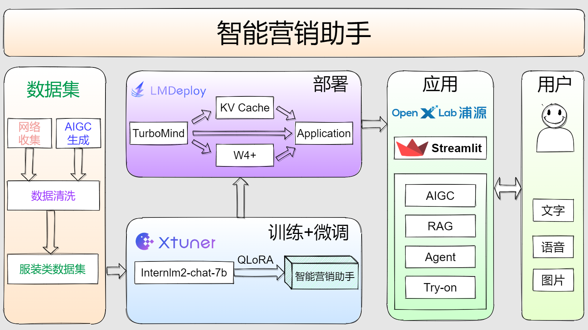
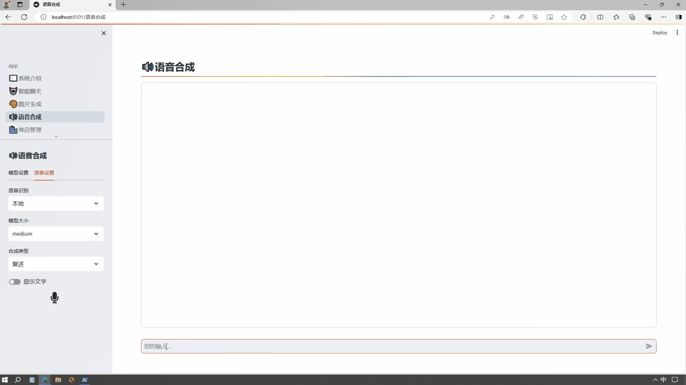

# 智能营销助手


## 📝目录

- [📖 简介](#-简介)
- [🚀 更新](#-更新)
- [🧾 任务](#-任务)
- [🛠️ 使用方法](#-使用方法)
  - [环境准备](#-环境准备)
    - [基础环境准备](#-基础环境准备)
    - [虚拟环境准备](#-虚拟环境准备)
  - [系统运行](#-系统运行)
- [🧾 未来规划](#-未来规划)
- [💕 致谢](#-致谢)

## 📖 简介

获客、活客、留客是电商行业的三大难题，谁拥有跟客户最佳的沟通方式，谁就拥有客户。

随着用户消费转移移至线上，电商行业面临一些问题：

- 用户交流体验差
- 商品推荐不精准
- 客户转化率低
- 退换货频率高
- 物流成本高

在这样的背景下，未来销售的引擎——大模型加持的智能营销助手就诞生了。

智能营销助手的模型由InternLM2-chat-7b指令微调而来，它能够**与用户的对话**，**了解用户的需求**，**基于多模态**的AIGC生成能力，应用层整合了**RAG、Agent、数字人、虚拟试穿、智能推荐**等功能，能够持续输出更符合用户消费习惯的文本、图片、语音和视频等营销内容，推荐符合用户的商品，将营销与经营结合。



- 🤖 **通用AIGC功能：** 项目提供了通用AIGC功能，可在营销的获客过程中增加用户的黏性，为获得最终的客户创造条件。包括：
  - 📖**文本生成**
  - 🎨**图片生成**
  - 🔊**语音生成**
  - 🎤**语音识别**
- 🎮**休闲游戏功能：** 项目提供了休闲小游戏功能，可以在玩游戏来使身心放松，并且还可以获得通用AIGC的使用额度，进一步增加用户黏性。
- 📚 **文案生成功能：** 项目提供了文案生成功能，对于卖家而言，在商品录入阶段，可以**根据商品的属性、商品的平铺图等生成商品营销文案**；对于买家而言，在商品咨询阶段，可以**根据商品信息生成商品介绍文案，激活用户的购买欲望**，为促成交易创造条件。
- 👩 **数字人功能：** 项目提供了📖**文本回复、🔊语音回复、👩数字人回复**等功能，让用户摆脱枯燥的交流方式，增加了更多形式的交流方式，增强了用户体验。
- 🙋🏻 **在线客服功能：** 项目提供了在线客服功能，可以解决销售旺季与销售淡季卖家对客服人员数量的需求不同的问题，可以随时随地为用户提供及时的服务，解决用户交流体验差的问题。同时在线客服集成了多种Agent工具，可以查询天气、查询快递、为用户推荐商品等，增强了用户体验。
- 💖 **智能推荐功能：** 项目提供了多种智能推荐方法，包括基于协同过滤的推荐、基于智能客服的个性化推荐，满足用户对商品的不同需求。
- 👚 **虚拟试穿功能：** 项目提供了虚拟试穿功能，用户可以选择自己的照片和喜欢的服装，在线即可完成试穿功能，提前体验试穿效果，可以降低退换货的概率，减少物流成本。

- 文本创作


- 图片创作


- 语音创作



- 文案生成


- 数字人


如果您觉得这个项目还不错，欢迎⭐Star，让更多的人发现它！

## 🚀 更新

🚀 [智能营销助手GPU版](https://openxlab.org.cn/apps/detail/AI-Labs/IntelligentSalesAssistant) 🚀 [智能营销助手CPU版](https://openxlab.org.cn/apps/detail/AI-Labs/IntelligentSalesAssistant-CPU) 🚀  

[2024.06.15] 完善休闲游戏功能  
[2024.05.30] 数字人功能  
[2024.05.15] 语音合成功能、商品咨询功能  
[2024.05.10] 图片生成功能  
[2024.05.05] 基于协同过滤的商品推荐  
[2024.05.01] 基于商品平铺图生成营销文案、 商品信息录入、基于商品信息创建知识库  
[2024.04.25] 智能营销助手第一版部署上线  


## 🧾 任务

- [x] 文本生成功能
- [x] 商品管理、基于商品信息的知识库创建
- [ ] 多模态数据处理
  - [x] 使用浦语·灵笔基于商品平铺图生成营销文案
  - [x] 图片生成功能
  - [x] 语音识别功能
  - [x] 语音生成功能
  - [x] 数字人功能
  - [x] 虚拟试穿功能
- [x] 基于协同过滤的商品推荐
- [x] Lagent工具调用
- [x] RAG检索
- [x] 休闲游戏
- [ ] 模型持续微调

## 🛠️ 使用方法

### 环境准备

#### 基础环境准备

```bash
apt-get install -y tree tmux libaio-dev ffmpeg git-lfs sqlite3
```

#### 虚拟环境准备

```bash
# 创建虚拟环境
studio-conda -t sales -o internlm-base
# 激活虚拟环境
conda activate sales
# 安装必要依赖
pip install -r requirements.txt
```

### 系统运行

```bash
streamlit run app.py
```

> 待继续完成~

## 未来规划

智能营销助手未来将会持续迭代。

- 在模型方面，将不断迭代模型微调，使模型更符合电商服装行业的营销。
- 在应用方面，将不断迭代应用功能，接入更多的Agent功能，优化数字人功能、虚拟试穿功能等，以满足各种不同的使用场景。

## 💕 致谢

***感谢 上海人工智能实验室 组织的书生·浦语大模型实战营学习活动 和 提供的强大算力支持~***

***感谢 OpenXLab 对项目部署的算力支持~***

***感谢 浦语小助手 对项目的支持~***

项目中所涉及的内容包括：

[**InternStudio**](https://studio.intern-ai.org.cn/)  
[**Tutorial**](https://github.com/InternLM/tutorial)  
[**InternLM**](https://github.com/InternLM/InternLM)  
[**XTuner**](https://github.com/InternLM/xtuner)  
[**InternLM-XComposer2**](https://github.com/InternLM/InternLM-XComposer)  
[**Lagent**](https://github.com/InternLM/lagent)  
[**LMDeploy**](https://github.com/InternLM/lmdeploy)  
[**InternLM-Math**](https://github.com/InternLM/InternLM-Math)

感谢项目中使用的其他开源组件，包括：

* 文本生图片模型：[Stable Diffusion](https://github.com/Stability-AI/stablediffusion)
* 语音转文本模型：[Whisper](https://github.com/openai/whisper)
* 文本转语音模型：[MeloTTS](https://github.com/myshell-ai/MeloTTS)
* 数字人生成模型：[V-Express](https://github.com/tencent-ailab/V-Express)

